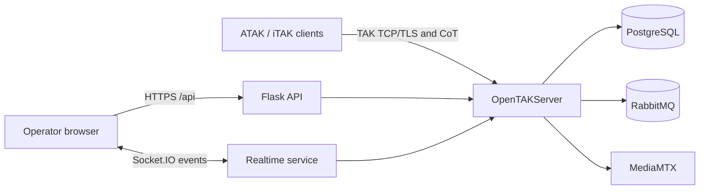
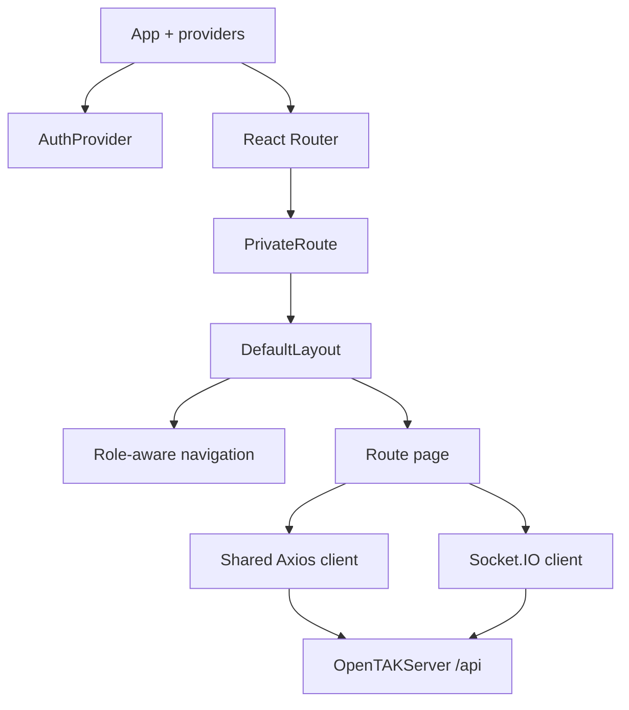

# OpenTAKServer UI

The browser interface for [OpenTAKServer](https://github.com/Ghost53574/OpenTAK). It gives operators one place to monitor TAK-connected devices, inspect Cursor on Target (CoT) traffic, manage collaboration content, and administer the server.

The UI is a React single-page application. It is served by the OpenTAKServer nginx deployment and talks to the Flask API and Socket.IO service on the same origin. It does not connect directly to ATAK or iTAK clients and does not change the TAK protocol.



## What is included

Navigation is organized around the operator's job:

- **Operations:** dashboard, live map, connected devices, CoT activity, alerts, and casualty evacuation records.
- **Collaboration:** missions, data packages, video streams and recordings, and TAK client certificates.
- **Administration:** users, groups, jobs, Meshtastic, ATAK packages, device profiles, plugins, and TAK.gov integration. Administrative routes are hidden and access-controlled for non-administrators.

Authentication uses the OpenTAKServer session as the source of truth. The anti-CSRF token is held in memory, API calls use the configured shared Axios client, and an expired session returns the user to the login screen. User preferences such as language and color scheme remain local to the browser.

## Requirements

- Node.js 24
- Corepack
- Yarn 4.12.0 (pinned in `.yarn/releases`)
- A running OpenTAKServer instance for API-backed development

## Set up a development checkout

From this repository:

```bash
corepack enable
yarn install --immutable
yarn dev
```

Vite serves the development UI. API requests use same-origin paths such as `/api`, so local integration requires the backend to be available through the development origin or a suitable reverse proxy. For a backend-independent check, use the test and production-build commands below.

Do not use `npm install`: Yarn Plug'n'Play and `yarn.lock` are the reproducible dependency source for this project.

## Quality checks

Run the same complete gate used by CI:

```bash
yarn test
yarn playwright install chromium
yarn test:browser
```

That command runs, in order:

1. TypeScript type checking
2. Prettier verification
3. ESLint and Stylelint
4. Vitest unit/component tests
5. The production Vite build

`yarn test:browser` additionally loads the production chunks in Chromium across
the operator and administrator routes, including simulated network failures.
It runs in CI after the build and uses API fixtures; it is not a replacement for
live server integration testing. To use a locally installed Chromium, set
`PLAYWRIGHT_CHROMIUM_EXECUTABLE_PATH` to its executable path.

For focused development:

```bash
yarn vitest:watch
yarn lint
yarn build
```

## Application structure

```text
src/
├── auth/                 Session and authorization state
├── components/           Shared shell and reusable presentation
│   ├── layout/           Page headers and async states
│   └── Navbar/           Searchable, role-aware navigation
├── pages/                Route-level operator workflows
├── apiRoutes.tsx         Same-origin API path constants
├── axios_config.tsx      Credentials, CSRF, and API error handling
├── navigation.tsx        Navigation groups and route metadata
├── routes.tsx            Route definitions and access requirements
└── socketio.tsx          Realtime client connection
```



## Adding or changing a page

1. Add the API path to `src/apiRoutes.tsx` when one does not already exist.
2. Put the route component in `src/pages` and use the shared Axios client from `src/axios_config.tsx`.
3. Add the route in `src/routes.tsx`. Set `administratorOnly` for privileged workflows.
4. Add its label, icon, description, and navigation group in `src/navigation.tsx`.
5. Reuse `PageHeader` and `AsyncState` for consistent titles, loading states, empty states, and errors.
6. Add a focused Vitest test, then run `yarn test`.

Never store passwords, session cookies, CSRF values, or API tokens in `localStorage`. Use the shared client for same-origin server APIs: it supplies credentials and session-expiry behavior. Public server-plugin index requests use the separate `src/pluginRepository.ts` client, which omits cookies and CSRF headers.

The Server Plugin Manager lists installed Python extensions on entry. **Browse Available Plugins** explicitly reads the configured external catalog, and **Install** starts the server package-manager action. An unavailable catalog leaves installed plugins visible. These extensions are separate from Android APK distribution through Plugin Updates; see the server's [server-plugin guide](https://github.com/Ghost53574/OpenTAK/blob/work/docs/user-guide.md#optional-server-plugins).

## Production build and deployment

```bash
yarn install --immutable
yarn build
```

The static application is written to `dist/`. OpenTAKServer's installer and `build-ui` command place that output behind nginx. Runtime API and Socket.IO traffic stays on the deployment's origin, so no production API URL is compiled into the bundle.

Tagged releases (`v*`) run the full CI gate and publish a zipped `opentakserver` directory containing the built assets. Branch and pull-request builds validate changes without publishing an artifact.

## Troubleshooting

- **Yarn uses an unexpected version:** run `corepack enable`; the repository's `packageManager` field and checked-in Yarn release select 4.12.0.
- **Immutable install fails:** do not regenerate the lockfile casually. Re-run a normal `yarn install` only when intentionally changing dependencies, review `yarn.lock`, then restore `--immutable` for verification.
- **The UI redirects to login:** confirm OpenTAKServer is reachable on the same origin and that browser cookies are accepted.
- **API mutations return 401/403:** refresh the session. The client obtains its CSRF token through the authenticated server flow.
- **Live status is disconnected:** check the Socket.IO endpoint and reverse-proxy websocket configuration; ordinary API availability does not prove that websocket upgrades work.
- **A production page is stale:** rebuild `dist/` and run OpenTAKServer's UI deployment command so nginx receives the new assets.

Server operation, ATAK/iTAK enrollment, endpoint reference, deployment diagrams, and administrator procedures are documented in the main [OpenTAK repository](https://github.com/Ghost53574/OpenTAK/tree/main/docs).
